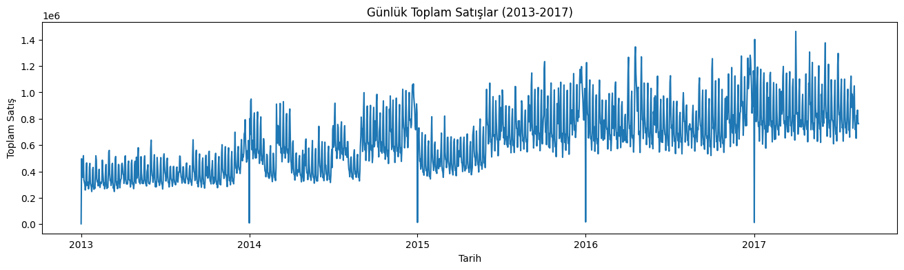
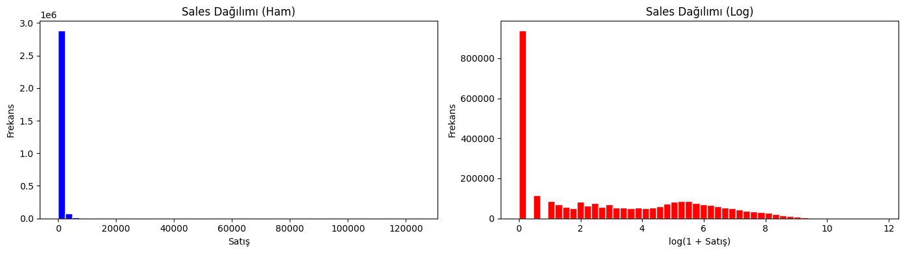
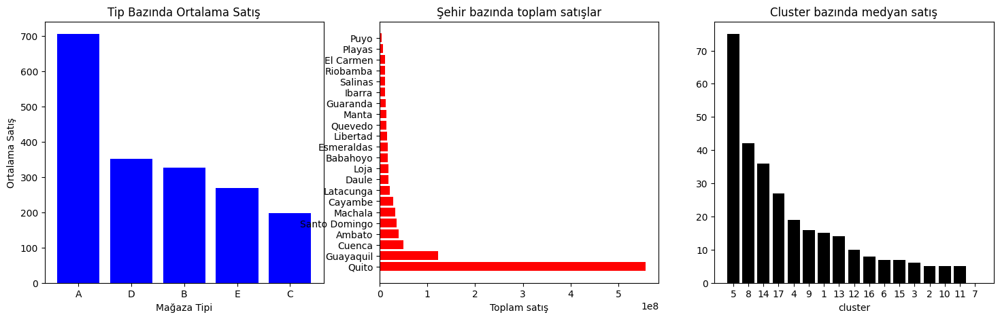
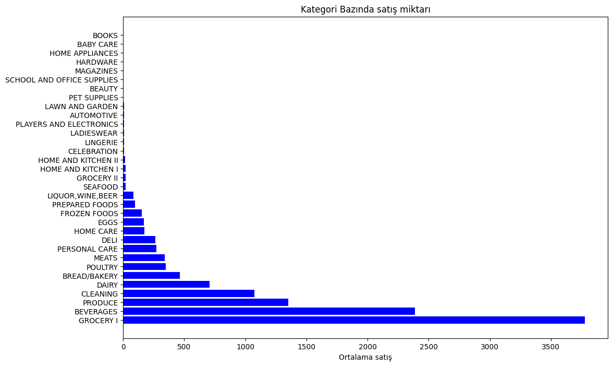
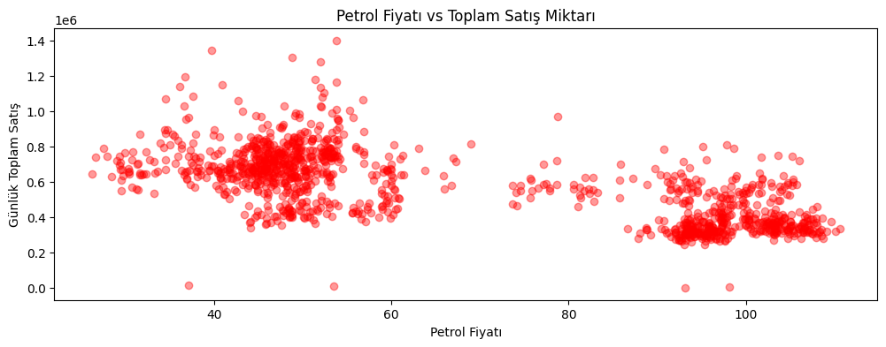

# Store Sales Zaman Serisi Tahmini

Kaggle üzerindeki [Store Sales Time Series Forecasting](https://www.kaggle.com/competitions/store-sales-time-series-forecasting) yarışması için hazırlanmış uçtan uca bir tahmin çalışması. Ekvador merkezli Corporación Favorita market zincirinin 54 mağazasında, 33 ürün kategorisinde günlük satışlar tahmin ediliyor.

Çalışma keşifsel veri analizinden özellik üretimine, model eğitiminden Kaggle gönderimine kadar dört notebook olarak ilerliyor. Doğrulama kümesinde elde edilen RMSLE değeri 0.3691.

**Kullanılan araçlar:** Python, pandas, NumPy, LightGBM, scikit-learn, Matplotlib, Seaborn, Jupyter

## Sonuçlar


| Ölçüt           | Değer     |
| --------------- | --------- |
| Doğrulama RMSLE | 0.3691    |
| En iyi tur      | 4498      |
| Özellik sayısı  | 31        |
| Eğitim satırı   | 2.924.262 |


Doğrulama kümesi, zaman serisi mantığına uygun biçimde kronolojik ayrılıyor. Model 2017 Temmuz sonuna kadarki veriyle eğitiliyor, son 15 gün doğrulama için ayrılıyor. Böylece gelecekten geçmişe bilgi sızması önleniyor.

## Veri Seti


| Dosya                 | İçerik                                                              |
| --------------------- | ------------------------------------------------------------------- |
| `train.csv`           | 3.000.888 satır, 2013-01-01 ile 2017-08-15 arası günlük satışlar    |
| `test.csv`            | 28.512 satır, 2017-08-16 ile 2017-08-31 arası tahmin edilecek dönem |
| `stores.csv`          | 54 mağazanın şehri, bölgesi, tipi ve kümesi                         |
| `oil.csv`             | Günlük ham petrol fiyatı, Ekvador ekonomisi petrole bağlı           |
| `holidays_events.csv` | Ulusal, bölgesel ve yerel tatiller ile özel günler                  |
| `transactions.csv`    | Mağaza başına günlük işlem sayısı                                   |


## Keşifsel Veri Analizi


### Satışlar zamanla büyüyor, haftalık ritim güçlü



Zincir 2013 ten 2017 ye doğru belirgin biçimde büyüyor. Haftalık dalgalanma çok net, her yılın ilk günü satışlar sıfıra düşüyor çünkü mağazalar kapalı. Aralık aylarındaki yükselişler yılbaşı etkisini gösteriyor.

### Hedef değişken sıfır ağırlıklı ve çarpık



Satırların yüzde 31.3 ünde satış sıfır. Birçok mağaza ürün kombinasyonu her gün satış yapmıyor. Dağılım sağa çok çarpık olduğu için model hedefi logaritmik ölçeğe çevrilerek eğitiliyor, tahminler sonra geri dönüştürülüyor. Yarışmanın metriği RMSLE olduğu için bu dönüşüm metrikle de uyumlu.

### Mağaza tipi satışın en güçlü ayırıcılarından




| Mağaza tipi | Mağaza sayısı | Ortalama satış |
| ----------- | ------------- | -------------- |
| A           | 9             | 705.9          |
| D           | 18            | 351.0          |
| B           | 8             | 326.7          |
| E           | 4             | 269.1          |
| C           | 15            | 197.3          |


Karşılaştırma toplam yerine ortalama üzerinden yapılıyor, çünkü tiplerin mağaza sayıları eşit değil. A tipi mağazalar C tipinin yaklaşık üç buçuk katı satış yapıyor. Mağazaların 18 i Quito, 8 i Guayaquil şehrinde.

### Kategoriler arasındaki fark çok büyük




| Ürün kategorisi | Ortalama satış |
| --------------- | -------------- |
| GROCERY I       | 3777.0         |
| BEVERAGES       | 2385.8         |
| PRODUCE         | 1349.4         |
| CLEANING        | 1072.4         |
| DAIRY           | 709.2          |


Diğer uçta BOOKS ve BABY CARE kategorileri ortalama 0.1 birim satıyor. En çok satan kategori ile en az satan arasında on binlerce kat fark var. Bu nedenle tek bir global model kurarken kategori bilgisinin modele girmesi şart.

### Promosyon etkisi çok belirgin


| Durum         | Satır sayısı | Ortalama satış |
| ------------- | ------------ | -------------- |
| Promosyon yok | 2.389.559    | 158.2          |
| Promosyon var | 611.329      | 1137.7         |


Promosyonlu satırlarda ortalama satış yedi kattan fazla. Bu nedenle hem promosyon ürün sayısı hem de promosyon var yok bilgisi modele ayrı birer değişken olarak giriyor.

### Petrol fiyatı ile satışlar ters yönlü



Günlük toplam satış ile ham petrol fiyatı arasındaki korelasyon -0.690. Ekvador ekonomisi petrol ihracatına bağlı olduğu için petrol fiyatı düşerken incelenen dönemde satışların arttığı görülüyor. Bu bir nedensellik iddiası değil, ikisi de aynı dönemdeki ekonomik koşullara tepki veriyor olabilir. Petrol verisinde borsa kapalı günlerden kaynaklanan boşluklar ileri ve geri doldurma ile tamamlanıyor.

### Tatil günleri satışı yukarı çekiyor


| Gün tipi   | Ortalama satış |
| ---------- | -------------- |
| Additional | 487.6          |
| Transfer   | 467.8          |
| Bridge     | 446.8          |
| Event      | 425.7          |
| Work Day   | 372.2          |
| Holiday    | 358.4          |
| Normal gün | 352.2          |


Resmi tatilin öncesine eklenen günler ve köprü günleri, normal günlerin belirgin biçimde üzerinde satış üretiyor.

## Özellik Üretimi

Modele 31 değişken giriyor. Dört grupta toplanıyorlar.

**Takvim değişkenleri:** yıl, ay, gün, haftanın günü, hafta sonu bayrağı, yılın kaçıncı haftası

**Gecikme değişkenleri:** 3, 7, 10, 14, 21, 24 ve 28 gün öncesinin satışı. Her mağaza ve ürün kategorisi kırılımında ayrı hesaplanıyor. Zaman serisi modellerinin en güçlü sinyali geçmiş satış olduğu için bu grup kritik.

**Hareketli ortalamalar:** aynı pencerelerde son günlerin ortalaması. Gecikme değişkeni tek bir günü yakalarken hareketli ortalama genel eğilimi daha kararlı yansıtıyor. Hesaplamada bir gün kaydırma yapılıyor, böylece tahmin edilen günün kendi satışı özelliğe sızmıyor.

**Kategorik kodlamalar:** ürün kategorisi, şehir, bölge, mağaza tipi ve tatil tipi sayısal kodlara çevriliyor.

## Model

LightGBM gradyan artırma modeli kullanılıyor. Hedef değişken `log1p` ile dönüştürülüp eğitiliyor, tahminler `expm1` ile geri alınıyor ve negatif değerler sıfıra çekiliyor.


| Parametre          | Değer | Gerekçe                                                   |
| ------------------ | ----- | --------------------------------------------------------- |
| `learning_rate`    | 0.03  | Yavaş ama kararlı öğrenme                                 |
| `num_leaves`       | 63    | Üç milyon satırda daha karmaşık örüntüleri yakalamak için |
| `min_data_in_leaf` | 50    | Yaprakların aşırı bölünmesini engellemek için             |
| `num_boost_round`  | 4500  | 100 turluk erken durdurma ile birlikte                    |


Doğrulama hatası 300 turda 0.3869 iken 4498 turda 0.3691 e iniyor. Erken durdurma tetiklenmiyor, bu da daha fazla turla küçük bir iyileşme daha alınabileceğini gösteriyor.

## Tahmin Ufku ve Özyinelemeli Tahmin

Test dönemi 16 gün sürüyor. Gecikme değişkenleri yalnızca eğitim verisinden okunursa 3 ve 7 günlük gecikmeler ufkun ilk birkaç gününden sonra karşılık bulamaz. Bu boşlukları sıfırla doldurmak modeli yanıltır, çünkü eğitimde sıfır gerçekten satış olmadığı anlamına geliyor ve satırların yüzde 31 i böyle.

Bu nedenle tahmin özyinelemeli yürütülüyor. Günler sırayla tahmin ediliyor ve her günün tahmini bir sonraki günün geçmişine ekleniyor. Böylece 31 değişkenin tamamı, eğitimdeki tanımıyla aynı anlamda doluyor. Üretilen değerlerin eğitimdeki tanımla birebir aynı olduğu, 1782 mağaza ve kategori serisinin tamamında eğitim verisi üzerinde karşılaştırılarak doğrulandı.

İşlem sayısı sütunu için üç seçenek doğrulama kümesinde ölçüldü.


| İşlem sayısı nasıl dolduruluyor              | RMSLE  |
| -------------------------------------------- | ------ |
| Gerçek değerlerle (tahmin anında ulaşılamaz) | 0.3691 |
| Sıfırla                                      | 2.7645 |
| Mağaza ve hafta günü ortalamasıyla           | 0.3751 |


Sıfırla doldurmak modeli tamamen bozuyor, çünkü tüm mağazaları kapalı göstermiş oluyor. Ortalamayla doldurma ise gerçek veriye çok yakın sonuç veriyor ve projede bu yöntem kullanılıyor.

## Proje Yapısı

```
.
├── README.md
├── requirements.txt
├── data/
│   └── README.md
├── notebooks/
│   ├── 01_eda.ipynb
│   ├── 02_feature_engineering.ipynb
│   ├── 03_model.ipynb
│   └── 04_submission.ipynb
├── images/
└── submissions/
    └── submission.csv
```


| Defter                         | İşlev                                                                                              |
| ------------------------------ | -------------------------------------------------------------------------------------------------- |
| `01_eda.ipynb`                 | Veri kalitesi kontrolü, hedef değişken analizi, mağaza, kategori, petrol ve tatil incelemeleri     |
| `02_feature_engineering.ipynb` | Tabloların birleştirilmesi, takvim, gecikme ve hareketli ortalama değişkenleri, kategorik kodlama  |
| `03_model.ipynb`               | Kronolojik ayrım, LightGBM eğitimi, RMSLE hesabı                                                   |
| `04_submission.ipynb`          | Test verisine aynı özelliklerin uygulanması, özyinelemeli tahmin ve gönderim dosyasının üretilmesi |


## Kurulum ve Çalıştırma

```bash
python -m venv .venv
source .venv/bin/activate
pip install -r requirements.txt
```


## Bilinen Sınırlar ve Geliştirme Fırsatları

**İşlem sayısı tahmin anında bilinmiyor.** `transactions.csv` dosyası 2017-08-15 tarihinde bitiyor. Bu sütun modelde güçlü bir kapı görevi görüyor, çünkü eğitimde sıfır işlem mağazanın o gün kapalı olduğu anlamına geliyor. Tahmin tarafında her mağazanın son dört haftadaki aynı hafta günü ortalaması kullanılarak dolduruluyor. Daha sağlam çözüm, tahmin anında elde olmayan bu değişkeni tamamen modelden çıkarmak olurdu.

**Özyinelemeli tahminde hata birikimi var.** Her günün tahmini sonraki günlerin girdisi olduğu için ufkun sonuna doğru hata birikiyor. Her ufuk mesafesi için ayrı model eğitmek, yani doğrudan çok adımlı tahmin, bu birikimi ortadan kaldırır.

`rolling_21` **değişkeni 28 günlük pencereyle üretilmiş.** Özellik üretim defterinde pencere değeri yanlışlıkla 28 yazılmış, bu da `rolling_28` ile aynı değişkenin iki kez modele girmesine yol açıyor. Model bu haliyle eğitildiği için tahmin tarafında da aynı pencere kullanılıyor. Düzeltmek için özellik üretiminin ve eğitimin yeniden çalıştırılması gerekiyor.

**Doğrulama tek bir pencereye dayanıyor.** Son 15 gün tek bir doğrulama kümesi olarak kullanılıyor. Kayan pencereli zaman serisi çapraz doğrulaması, skorun tesadüfe ne kadar bağlı olduğunu gösterir.

**Mağaza ve ürün kırılımı düzleştirilmiş durumda.** Tek bir global model kuruluyor. Kategori bazlı ayrı modeller ya da hiyerarşik uzlaştırma yaklaşımları bu veri setinde genellikle kazanç sağlıyor.

## English Summary

An end to end solution for the Kaggle Store Sales Time Series Forecasting competition, predicting daily sales across 54 Corporación Favorita stores and 33 product families in Ecuador. The work moves through four notebooks covering exploratory analysis, feature engineering, model training and submission.

The exploratory phase shows a growing chain with strong weekly seasonality, a target where 31.3 percent of rows are zero, average sales ranging from 197 to 706 across store types, a sevenfold lift on promoted rows, and a correlation of -0.690 between daily sales and crude oil price. Feature engineering produces 31 inputs: calendar variables, lag features at seven horizons, shifted rolling means that avoid leakage, and label encoded categoricals. A LightGBM model is trained on a log transformed target with a chronological split, reaching an RMSLE of 0.3691 on the final 15 days. Predictions over the 16 day test horizon are produced recursively, feeding each day's forecast back into the history so that every lag and rolling feature keeps the meaning it had during training. Known limitations and concrete improvement paths are documented above.